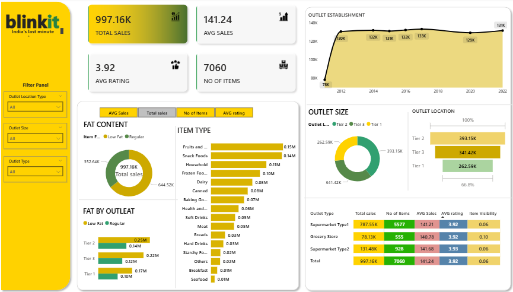

📊 Project Overview
This Power BI dashboard project focuses on Blinkit, a quick-commerce platform. The goal is to analyze sales performance across various outlet types, item categories, and locations. The data has been fully cleaned and transformed to support meaningful, decision-ready insights for business stakeholders.

🎯 Project Objectives
To provide a clear visual summary of overall sales performance.
To help stakeholders understand trends across outlet types, item categories, and customer preferences.
To support data-driven decision-making by highlighting key business drivers.

🧰 Tools Used
Power BI Desktop – for data modeling and building the dashboard.
Power Query Editor – for data cleaning and transformation.
Excel / CSV – as the source files prior to loading into Power BI.

📁 Files Included in the Project Folder
- Blinkit_Sales_Dashboard.pbix 
– the Power BI report file.
- Cleaned_Data.xlsx
- Raw_data
- Dashboard_Screenshot.png
  
🔍 Key Insights
Total Sales reached 997.16K across all outlets.
Top-performing product categories include Fruits & Vegetables and Snack Foods.
Tier 2 outlets outperformed others, generating the highest revenue at 393.15K.
Supermarket Type 1 had the highest number of items and total sales, making it the most impactful outlet type.
Outlet establishment trends show consistent growth over the years, with a slight dip around 2019–2020, then recovering in 2022.
Low Fat items slightly outperform regular fat items, reflecting a shift toward healthier preferences.
Average customer rating remains stable at 3.92, indicating consistent customer satisfaction.
