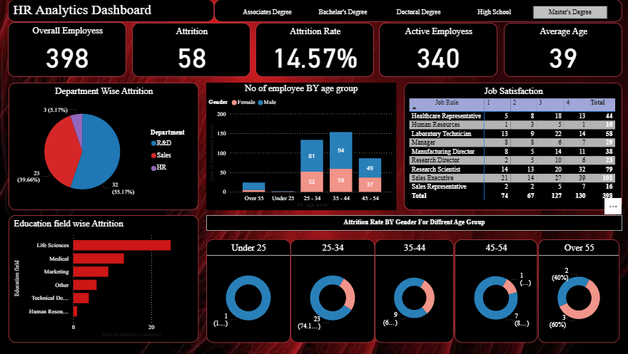

# 📊 Power BI Projects

This repository contains a collection of my Power BI dashboards built for practice, learning, and showcasing my data visualization skills.

Each folder represents a different project with its own dataset, .pbix file, screenshot, and project summary.

## 🗂️ Projects Included

- 
 – Analyze employee attrition, satisfaction, and demographics.

More projects will be added soon!

## 💡 Tools Used

- Power BI Desktop
- DAX (Data Analysis Expressions)
- Microsoft Excel (for some datasets)

---

Feel free to explore the dashboards and share your feedback!  
📬 Contact: [Fahrizahaldi52@gmail.com] 
🌐 LinkedIn: [https://www.linkedin.com/in/fahriza-haldi-b72168373]
