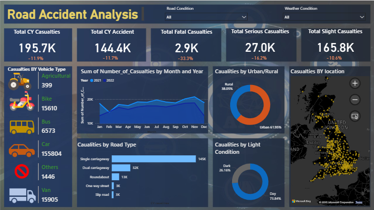

# 🛣️ Road Accident Analysis Dashboard

This interactive dashboard presents a comprehensive analysis of road accident data with multiple breakdowns, including:

- Total Casualties** (fatal, serious, slight)
- Vehicle Types Involved**
- Monthly Trend of Casualties**
- Urban vs Rural Distribution**
- Accidents by Road Type & Light Condition**
- Geographic Distribution of Accidents (UK)**

---

## 📊 Tools & Technologies

- Power BI Desktop
- Visualizations used:
  - Line Charts, Bar Charts, Pie Charts
  - Map Visual with Location Data
  - Slicers for Road and Weather Conditions

---

Created by Fahriza Haldi  
GitHub: (https://github.com/aldifahriza)

---

## 📌 Notes

- All data used in this dashboard is for educational and analytical purposes only.
- Built as a portfolio project to demonstrate Power BI skills and data storytelling.

